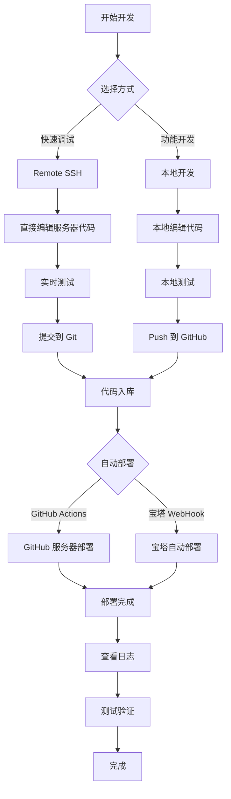

# 🚀 CI/CD 完整部署方案

## ✨ 三种方案任你选择！

---

## 📋 方案对比

| 方案 | 优点 | 缺点 | 适用场景 |
|------|------|------|----------|
| **1️⃣ Remote SSH** | ✅ 实时编辑<br>✅ 立即生效<br>✅ 无需同步 | ⚠️ 需要网络连接<br>⚠️ 直接在生产环境操作 | 🔧 调试问题<br>🔬 测试功能 |
| **2️⃣ GitHub Actions** | ✅ 专业CI/CD<br>✅ 支持测试<br>✅ 有部署日志 | ⚠️ 需要配置密钥<br>⚠️ GitHub服务器在国外 | 🏢 团队协作<br>📦 正式发布 |
| **3️⃣ 宝塔 WebHook** | ✅ 简单配置<br>✅ 国内快速<br>✅ 可视化管理 | ⚠️ 功能相对简单<br>⚠️ 需要宝塔面板 | 👤 个人项目<br>⚡ 快速迭代 |

---

## 🎯 推荐方案

### 🥇 **最佳组合：Remote SSH + 宝塔 WebHook**

```
日常开发：
  使用 Remote SSH 直接在服务器开发
  实时测试，快速迭代
  
正式发布：
  提交代码到 GitHub
  宝塔 WebHook 自动部署
  保证代码版本控制
```

---

## 📚 详细文档

### 1️⃣ Remote SSH 开发

详见：**[Remote-SSH配置指南.md](./Remote-SSH配置指南.md)**

**快速开始**：

1. 安装 Remote-SSH 扩展
2. 配置 SSH 连接
3. 连接到服务器
4. 开始开发！

---

### 2️⃣ GitHub Actions 自动部署

详见：**[GitHub-Actions配置指南.md](./GitHub-Actions配置指南.md)**

**快速开始**：

1. 生成 SSH 密钥对
2. 添加公钥到服务器
3. 添加私钥到 GitHub Secrets
4. Push 代码自动部署！

---

### 3️⃣ 宝塔 WebHook 部署

详见：**[宝塔WebHook配置指南.md](./宝塔WebHook配置指南.md)**

**快速开始**：

1. 在宝塔添加 WebHook
2. 在 GitHub 配置 WebHook URL
3. Push 代码自动部署！

---

## 🎨 工作流程示例

### 场景 1：日常开发调试

```
1. 使用 Remote SSH 连接服务器
2. 直接编辑代码
3. 在服务器终端测试
4. 确认无误后提交到 Git
```

**优势**：快速、实时、无需等待

---

### 场景 2：功能开发

```
1. 本地创建开发分支
2. 开发新功能
3. 本地测试通过
4. 合并到 main 分支
5. Push 后自动部署（WebHook/GitHub Actions）
```

**优势**：安全、规范、可回滚

---

### 场景 3：紧急修复

```
1. Remote SSH 连接服务器
2. 直接修复问题
3. 立即测试验证
4. 修复后提交代码
```

**优势**：快速响应、立即生效

---

## 🔄 完整开发流程



---

## 🛠️ 配置步骤总览

### 初始配置（一次性）

#### Remote SSH

```bash
# 1. 安装 Remote-SSH 扩展
# 2. 配置 ~/.ssh/config

Host aliyun-novel
    HostName 8.130.74.146
    User root
    Port 22
```

#### GitHub Actions

```bash
# 1. 生成 SSH 密钥
ssh-keygen -t rsa -b 4096 -f github-actions-key

# 2. 添加公钥到服务器
cat github-actions-key.pub | ssh root@8.130.74.146 "cat >> ~/.ssh/authorized_keys"

# 3. 添加私钥到 GitHub Secrets
# Name: SSH_PRIVATE_KEY
# Value: <私钥内容>
```

#### 宝塔 WebHook

```bash
# 1. 宝塔面板安装 WebHook 插件
# 2. 添加钩子，执行脚本：
bash /www/wwwroot/ai-novel-assistant/webhook-deploy.sh

# 3. GitHub 配置 WebHook
# Payload URL: http://8.130.74.146:8888/hook?access_key=xxx&token=xxx
```

---

## 📊 性能对比

### 部署速度

| 方案 | 首次部署 | 后续部署 | 触发延迟 |
|------|----------|----------|----------|
| Remote SSH | 立即 | 立即 | 0秒 |
| GitHub Actions | 3-5分钟 | 2-3分钟 | 10-30秒 |
| 宝塔 WebHook | 2-3分钟 | 1-2分钟 | 1-5秒 |

### 稳定性

| 方案 | 成功率 | 错误处理 | 日志记录 |
|------|--------|----------|----------|
| Remote SSH | ⭐⭐⭐⭐ | 手动 | 服务器日志 |
| GitHub Actions | ⭐⭐⭐⭐⭐ | 自动重试 | 完整日志 |
| 宝塔 WebHook | ⭐⭐⭐⭐ | 邮件通知 | 宝塔日志 |

---

## 💡 最佳实践

### ✅ 推荐做法

#### 开发阶段

- ✅ 使用 Remote SSH 快速迭代
- ✅ 频繁提交小改动
- ✅ 实时测试验证

#### 测试阶段

- ✅ 创建测试分支
- ✅ 使用 GitHub Actions 自动测试
- ✅ 代码审查后合并

#### 生产部署

- ✅ 使用 Git 标签标记版本
- ✅ 保留部署日志
- ✅ 部署后验证功能
- ✅ 准备回滚方案

### ❌ 避免做法

- ❌ 不要在生产环境直接修改不提交
- ❌ 不要跳过测试直接部署
- ❌ 不要忽略部署日志
- ❌ 不要在多处同时修改同一文件

---

## 🔒 安全建议

### SSH 密钥管理

```bash
# 定期更换密钥
ssh-keygen -t rsa -b 4096 -C "new-key-$(date +%Y%m%d)"

# 限制密钥权限
chmod 600 ~/.ssh/id_rsa
chmod 644 ~/.ssh/id_rsa.pub

# 使用不同密钥用于不同环境
~/.ssh/id_rsa_prod    # 生产环境
~/.ssh/id_rsa_dev     # 开发环境
```

### GitHub Secrets

- 🔒 不要在代码中硬编码密码
- 🔒 使用 GitHub Secrets 存储敏感信息
- 🔒 定期审查和更新 Secrets
- 🔒 限制仓库访问权限

### 服务器安全

```bash
# 禁用 root 密码登录
sed -i 's/PermitRootLogin yes/PermitRootLogin prohibit-password/' /etc/ssh/sshd_config

# 只允许密钥登录
sed -i 's/#PasswordAuthentication yes/PasswordAuthentication no/' /etc/ssh/sshd_config

# 重启 SSH 服务
systemctl restart sshd
```

---

## 🆘 故障排查

### Remote SSH 连接失败

```bash
# 检查 SSH 服务
systemctl status sshd

# 检查防火墙
ufw status

# 测试连接
ssh -v root@8.130.74.146
```

### GitHub Actions 部署失败

```bash
# 查看 GitHub Actions 日志
# GitHub 仓库 → Actions → 点击失败的 workflow

# 在服务器手动测试
ssh root@8.130.74.146
cd /www/wwwroot/ai-novel-assistant
git pull
npm install
```

### WebHook 未触发

```bash
# 检查宝塔 WebHook 日志
# 宝塔面板 → WebHook → 查看日志

# 手动触发
curl -X POST "http://8.130.74.146:8888/hook?access_key=xxx&token=xxx"

# 检查脚本权限
ls -la /www/wwwroot/ai-novel-assistant/webhook-deploy.sh
```

---

## 📈 监控和日志

### 部署日志

```bash
# Remote SSH：查看 PM2 日志
pm2 logs ai-novel-backend

# GitHub Actions：GitHub 网页查看

# 宝塔 WebHook：查看部署日志
tail -f /www/wwwroot/ai-novel-assistant/deploy.log
```

### 性能监控

```bash
# 服务器性能
htop

# 应用性能
pm2 monit

# 网站可用性
curl -I http://8.130.74.146:3000/health
```

---

## 🎉 总结

### 选择建议

| 如果你... | 推荐方案 |
|----------|---------|
| 🔰 刚开始学习 | Remote SSH |
| 👤 个人项目 | 宝塔 WebHook |
| 👥 团队协作 | GitHub Actions |
| 🚀 追求最快 | Remote SSH |
| 🏢 企业级项目 | GitHub Actions |
| 💰 节省成本 | 宝塔 WebHook |

### 组合使用

**最佳组合**：Remote SSH（开发） + 宝塔 WebHook（部署）

- ✅ 开发时快速
- ✅ 部署时自动
- ✅ 代码有版本控制
- ✅ 配置简单易用

---

## 📚 相关文档

- 📖 [Remote-SSH配置指南.md](./Remote-SSH配置指南.md)
- 📖 [GitHub-Actions配置指南.md](./GitHub-Actions配置指南.md)
- 📖 [宝塔WebHook配置指南.md](./宝塔WebHook配置指南.md)
- 📖 [阿里云快速开始.md](./阿里云快速开始.md)

---

**开始你的自动化部署之旅！** 🚀

